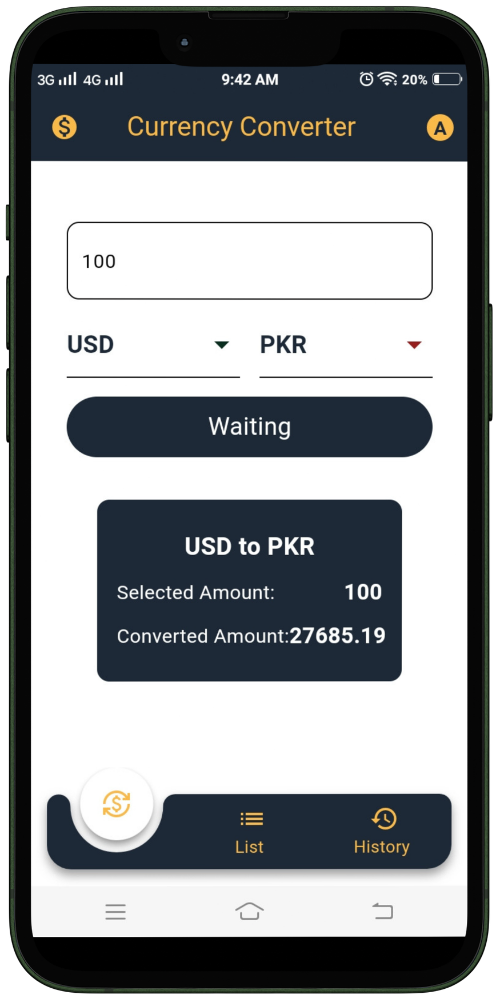

# Currency Converter Flutter App

          

The Currency Converter Flutter App is a simple yet powerful mobile application designed to help users convert currencies effortlessly. Built using the Flutter framework, this app leverages an Exchange Rate API to provide real-time and accurate currency conversion rates.

## Features

### 1. Intuitive User Interface
A user-friendly interface that makes currency conversion easy and accessible.

### 2. Real-Time Exchange Rates
Utilizes the Exchange Rate API to fetch the latest and most accurate exchange rates.

### 3. Multi-Currency Support
Convert between a wide range of currencies, supporting global transactions.

### 4. Offline Mode
Access the last known exchange rates even without an internet connection for convenience.

### 5. History Tracking
Keeps track of conversion history for easy reference.

## Demo

Check out the app in action: [Currency Converter App Demo Video](https://www.mediafire.com/file/036fejz78rpip4x/currencyconverter.mp4/file)
